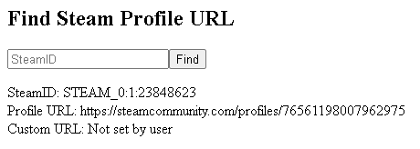

# steam-profile-url
Calculate Steam Profile URL from SteamID (without Steam Web API)

* Validates user input
* Calculates Steam Profile URL
* Checks for Custom URL

An example project on implementing the 64-bit formula `W=Z*2+V+Y` (as described [here](https://developer.valvesoftware.com/wiki/SteamID)) for finding a Steam Profile URL from a SteamID without the use of the Steam Web API, in case you don't want to get an API key for such a simple task which can be done without it.

